# Лабораторная работа №9

**Дисциплина:** Технологии программирования для мобильных приложений

**Тема:** Проектирование мобильного приложения с организацией непрерывной сборки и автоматического тестирования

**Студент:** Юранов Никита  
**Группа:** 12b  
**Вариант:** Проект 1 — Мобильное банковское приложение (BankingApp)

---

## Содержание

1. [Введение](#введение)
2. [Задача №1: Создание проекта для управления разработкой](#задача-1)
3. [Задача №2: Проектирование интерфейса, разработка требований и документирование](#задача-2)
4. [Задача №3: Настройка CI/CD и разработка тестов](#задача-3)
5. [Задача №4: Разработка приложения](#задача-4)
6. [Заключение](#заключение)

---

## Введение

### Цель работы

Освоить полный цикл разработки iOS-приложения: проектирование интерфейса, разработку требований, реализацию на Swift + SwiftUI с архитектурой MVVM, хранение данных в SQLite, организацию непрерывной интеграции через GitHub Actions, написание Unit- и UI-тестов с XCTest, а также локализацию приложения на три языка.

### Задачи

- Создать мобильное банковское приложение (Проект 1) на Swift + SwiftUI с архитектурой MVVM
- Организовать управление проектом: GitHub репозиторий, Kanban-доска, Issues
- Спроектировать интерфейс приложения в Figma (не менее 3 экранов)
- Разработать спецификацию требований (REQUIREMENTS.md) с диаграммами
- Настроить CI/CD-пайплайн через GitHub Actions
- Написать не менее 10 Unit-тестов и 10 UI-тестов с использованием XCTest
- Реализовать локализацию на русский, английский и белорусский языки

### Используемые технологии

| Технология | Версия / Назначение |
|---|---|
| Swift | 6.3 |
| SwiftUI | iOS 26.5 SDK |
| SQLite.swift | 0.15.3+ — хранение данных (таблицы users, accounts, transactions, branches) |
| UserDefaults | Хранение настроек и сессии (SettingsManager) |
| MVVM | Архитектурный шаблон |
| XCTest | Unit- и UI-тестирование |
| GitHub Actions | CI/CD |
| Figma | Прототипирование интерфейса |
| MapKit + CoreLocation | Карта отделений и геолокация |

---

## Задача №1: Создание проекта для управления разработкой

### 1.1 Создание репозитория на GitHub

Создан публичный репозиторий **BankingApp** в профиле тимлида проекта.

**Шаги:**
1. Перейти на [github.com](https://github.com) → New repository
2. Название: `BankingApp`, видимость: Public
3. Добавить `README.md`, `.gitignore` 
4. Нажать «Create repository»

**Настройка защиты ветки `main`** (Settings → Branches → Add branch protection rule):

```bash
# Branch name pattern: main
# ✅ Require a pull request before merging
# ✅ Require approvals (минимум 1)
# ✅ Require status checks to pass before merging (статус: build-and-test)
# ✅ Require branches to be up to date before merging
```

**Структура веток:**

| Ветка | Назначение |
|---|---|
| `main` | Production-версия; merge только через PR после прохождения CI |
| `develop` | Основная ветка разработки |
| `feature/*` | Отдельные функции (например, `feature/transfer-view`) |

### 1.2 Создание Kanban-доски (GitHub Projects)

Создан проект **BankingApp Board** в разделе GitHub Projects (стиль Kanban).

**Колонки доски:**

| Колонка | Описание |
|---|---|
| Backlog | Все запланированные задачи |
| To Do | Готовые к выполнению |
| In Progress | В работе |
| Review | На проверке (Pull Request) |
| Done | Выполнены |

### 1.3 Роли и распределение задач

**Роли участников:**

| Роль | Участник | Обязанности |
|---|---|---|
| Тимлид / Разработчик | Юранов Никита | Архитектура, весь код (Models, ViewModels, Services, Views), тесты (Unit + UI), CI/CD, README, ревью PR |
| Аналитик / Проектировщик | Иван Насенник | Спецификация требований, UML-диаграммы, физическая ERD, макеты Figma, Wiki, презентация проекта |

**Таблица задач (Issues):**

| № | Название задачи | Метки | Ответственный |
|---|---|---|---|
| 1 | Создание структуры проекта и настройка Xcode | `setup` | Юранов Никита |
| 2 | Создание моделей данных (Models) | `database`, `feature` | Юранов Никита |
| 3 | Настройка SQLite базы данных (DatabaseManager) | `database` | Юранов Никита |
| 4 | Реализация аутентификации (AuthViewModel) | `feature` | Юранов Никита |
| 5 | Создание экрана входа и регистрации (LoginView, RegisterView) | `ui` | Юранов Никита |
| 6 | Реализация управления счетами (AccountsViewModel, AccountsView) | `feature`, `ui` | Юранов Никита |
| 7 | Реализация переводов (TransferViewModel, TransferView) | `feature`, `ui` | Юранов Никита |
| 8 | Реализация курсов валют (CurrencyViewModel, CurrencyView) | `feature`, `ui` | Юранов Никита |
| 9 | Реализация карты отделений (BranchViewModel, BranchMapView) | `feature`, `ui` | Юранов Никита |
| 10 | Реализация профиля и настроек (ProfileView, SettingsView) | `feature`, `ui` | Юранов Никита |
| 11 | Написание Unit-тестов (BankingAppTests) | `test` | Юранов Никита |
| 12 | Написание UI-тестов (BankingAppUITests) | `test` | Юранов Никита |
| 13 | Настройка CI/CD (GitHub Actions) | `ci/cd` | Юранов Никита |
| 14 | Создание README.md | `documentation` | Юранов Никита |
| 15 | Создание .gitignore и .gitattributes | `setup` | Юранов Никита |
| 16 | Создание Use Case диаграммы | `diagram`, `uml` | Иван Насенник |
| 17 | Создание Class диаграммы | `diagram`, `uml` | Иван Насенник |
| 18 | Создание Sequence диаграммы | `diagram`, `uml` | Иван Насенник |
| 19 | Создание Activity диаграммы | `diagram`, `uml` | Иван Насенник |
| 20 | Создание ER-диаграммы | `diagram`, `uml` | Иван Насенник |
| 21 | Создание Component диаграммы | `diagram`, `uml` | Иван Насенник |
| 22 | Создание Package диаграммы | `diagram`, `uml` | Иван Насенник |
| 23 | Создание Deployment диаграммы | `diagram`, `uml` | Иван Насенник |
| 24 | Создание REQUIREMENTS.md | `diagram` | Иван Насенник |
| 25 | Создание Wiki: Главная страница | `wiki` | Иван Насенник |
| 26 | Создание Wiki: Функциональные требования | `wiki` | Иван Насенник |
| 27 | Создание Wiki: Архитектура | `wiki` | Иван Насенник |
| 28 | Создание Wiki: Дополнительная спецификация | `wiki` | Иван Насенник |
| 29 | Создание Wiki: Схема базы данных | `wiki` | Иван Насенник |
| 30 | Создание Wiki: Тестирование | `wiki` | Иван Насенник |
| 31 | Создание Wiki: Презентация проекта | `wiki` | Иван Насенник |
| 32 | Создание Wiki: CI/CD | `wiki` | Иван Насенник |
| 33 | Создание макетов в Figma | `design` | Иван Насенник |
| 34 | Создание диаграммы физической модели базы данных (Physical ERD) | `database`, `diagram`, `erd` | Иван Насенник |
| 35 | Создание презентации проекта | `documentation` | Иван Насенник |

---

## Задача №2: Проектирование интерфейса, разработка требований и документирование

### 2.1 Разработка макетов в Figma (Упражнение 2.1)

Разработаны макеты приложения с соблюдением рекомендаций [Apple Human Interface Guidelines](https://developer.apple.com/design/human-interface-guidelines/). Создано 7 экранов:

| № | Экран | Описание |
|---|---|---|
| 1 | LoginView | Ввод логина и пароля, кнопка «Demo», переход к регистрации |
| 2 | RegisterView | Поля: ФИО, email, телефон, логин, пароль, подтверждение пароля |
| 3 | AccountsView | Список счетов клиента с отображением суммарного баланса в BYN |
| 4 | TransferView | Перевод между счетами с выбором суммы и конвертацией валют |
| 5 | CurrencyView | Таблица курсов 7 валют к BYN и встроенный конвертер |
| 6 | BranchMapView | Карта с аннотациями отделений банка и поиском ближайшего |
| 7 | ProfileView | Отображение информации пользователя (ФИО, email, телефон), аватар, статистика по счетам (общий баланс, количество счетов), кнопки редактирования профиля, смены пароля, настроек и выхода из аккаунта |

### 2.2 Разработка требований (Упражнение 2.2)

Создан файл `REQUIREMENTS.md` в корне репозитория.

**1. Назначение приложения**

Мобильное банковское приложение для iOS, предоставляющее клиентам банка персональный доступ к счетам, переводам, курсам валют и информации об отделениях.

**2. Общее описание**

Пользователи — физические лица, клиенты банка.

Требования к программному обеспечению:

| Параметр | Значение |
|---|---|
| Платформа | iOS 26.5+ |
| Среда разработки | Xcode 26.5+ |
| Язык | Swift 6.3 |
| UI-фреймворк | SwiftUI (iOS 26.5 SDK) |
| БД | SQLite.swift 0.15.3+ |
| Архитектура | MVVM |

Требования к аппаратному обеспечению:

| Параметр | Значение |
|---|---|
| Целевое устройство | iPhone 17 Pro |
| Архитектура процессора | Apple Silicon (ARM64) |
| ОС разработчика | macOS Tahoe 26.2+ |

**3. Спецификация требований**

**3.1 Функциональные требования:**

| ID | Требование |
|---|---|
| FR-1 | Аутентификация: регистрация и вход по логину/паролю, хранение сессии в UserDefaults |
| FR-2 | Управление счетами: просмотр активных и заблокированных счетов (типы: current, savings, credit, card); закрытые не отображаются |
| FR-3 | Поддержка карт-счёта: подтипы savings и credit; для зарплатного — овердрафт |
| FR-4 | Переводы между счетами с конвертацией через базовую валюту BYN; лимиты суммы: 0.01–10 000 BYN |
| FR-5 | Курсы валют: 7 валют (USD, EUR, RUB, GBP, CNY, PLN, UAH), конвертер, избранное |
| FR-6 | Карта отделений: MapKit, геолокация, поиск ближайшего отделения, маршрут |
| FR-7 | Профиль: редактирование данных, смена аватара (PhotosPicker), смена пароля |
| FR-8 | Настройки: переключение темы (светлая/тёмная/системная), языка приложения |
| FR-9 | Локализация на 3 языка: русский, английский, белорусский |

**3.2 Удобство использования:**
- Соответствие Apple Human Interface Guidelines
- Поддержка светлой и тёмной темы
- Tab Bar навигация (5 вкладок)
- Понятные сообщения об ошибках на текущем языке интерфейса

**3.3 Требования надёжности:**
- Корректная обработка ошибок SQLite (try/catch)
- Транзакционная запись переводов в БД
- Сохранение сессии в UserDefaults; автоматический вход при повторном запуске

**3.4 Требования производительности:**
- Холодный запуск приложения < 2 секунд
- Загрузка списка счетов из SQLite < 1 секунды
- Отображение карты с аннотациями отделений < 2 секунд

**4. Диаграммы**

**4.1 Варианты использования (Use Case):**

Актёр — Клиент банка. Варианты использования: Войти в систему, Зарегистрироваться, Просмотреть счета, Выполнить перевод, Просмотреть курсы валют, Конвертировать валюту, Найти ближайшее отделение, Редактировать профиль, Изменить настройки, Выйти из системы.

**4.2 Диаграмма классов (MVVM):**

Основные классы: `AuthViewModel`, `AccountsViewModel`, `TransferViewModel`, `CurrencyViewModel`, `BranchViewModel`, `ProfileViewModel` — все наследуют `ObservableObject`. Сервисы: `DatabaseManager` (singleton, SQLite.swift), `SettingsManager` (singleton, UserDefaults). Модели: `User`, `Account`, `Transaction`, `Branch`, `CurrencyRate`.

**4.3 Физическая модель БД (SQLite):**

| Таблица | Столбцы (ключевые) |
|---|---|
| `users` | `id` PK, `full_name`, `email`, `phone`, `login` UNIQUE, `password`, `avatar_data`, `created_at` |
| `accounts` | `id` PK, `user_id` FK→users, `name`, `type`, `card_subtype`, `balance`, `currency`, `is_active`, `overdraft_limit`, `created_at` |
| `transactions` | `id` PK, `account_id` FK→accounts, `type`, `amount`, `currency`, `description`, `related_account_id`, `created_at` |
| `branches` | `id` PK, `name`, `address`, `phone`, `working_hours`, `latitude`, `longitude`, `services`, `rating` |

### 2.3 Документирование проекта (Упражнение 2.3)

**Структура README.md:** Project Name, Description, Installation, Usage (со скриншотами), Contributing.

**Структура Wiki репозитория:**
- Главная страница — описание проекта и ссылки на разделы
- Функциональные требования — Use Case диаграммы и текстовые сценарии
- Диаграмма файлов приложения — структура папок и назначение файлов
- Дополнительная спецификация — ограничения безопасности, надёжности
- Схема базы данных — ER-диаграмма таблиц SQLite
- Презентация проекта — распределение задач, требования, схема БД

**Структура файлов приложения:**

```
BankingApp/
├── BankingApp.swift               # Точка входа (@main)
├── String+Localized.swift         # Расширение для локализации
├── Models/
│   └── Models.swift               # User, Account, Transaction, Branch, CurrencyRate
├── ViewModels/
│   ├── AuthViewModel.swift        # Аутентификация и регистрация
│   ├── AccountsViewModel.swift    # Список счетов, CRUD
│   ├── TransferViewModel.swift    # Переводы с валютной конвертацией
│   ├── CurrencyViewModel.swift    # Курсы валют и конвертер
│   ├── BranchViewModel.swift      # Карта отделений, геолокация
│   └── ProfileViewModel.swift     # Профиль и смена пароля
├── Views/
│   ├── ContentView.swift          # Корневое представление (роутинг)
│   ├── MainTabView.swift          # Tab Bar (5 вкладок)
│   ├── Auth/AuthViews.swift       # LoginView, RegisterView
│   ├── Accounts/AccountsView.swift
│   ├── Transfer/TransferView.swift
│   ├── Currency/CurrencyView.swift
│   ├── Map/BranchMapView.swift
│   └── Profile/ProfileView.swift
├── Services/
│   ├── DatabaseManager.swift      # SQLite singleton (CRUD, транзакции)
│   └── SettingsManager.swift      # UserDefaults singleton (сессия, настройки)
└── Resources/
    ├── ru.lproj/Localizable.strings
    ├── en.lproj/Localizable.strings
    └── be.lproj/Localizable.strings
```

---

## Задача №3: Настройка CI/CD и разработка тестов

### 3.1 Настройка GitHub Actions

Создан файл `.github/workflows/ios-ci.yml`. Изучены материалы:
- [Github Actions for iOS projects](https://sarunw.com/posts/github-actions-for-ios-projects/)
- [iOS CI/CD with GitHub Actions](https://medium.com/thefork/ios-ci-cd-with-github-actions-e4504228c9d)
- Шаблон: https://github.com/Apple-Actions/Example-iOS

**Файл конфигурации `.github/workflows/ios-ci.yml`:**

```yaml
name: iOS CI/CD

on:
  push:
    branches: [ main, develop ]
  pull_request:
    branches: [ main ]

jobs:
  build-and-test:
    name: Build and Test
    runs-on: macos-latest

    steps:
      - name: Checkout code
        uses: actions/checkout@v4

      - name: Select Xcode
        run: sudo xcode-select -switch /Applications/Xcode_16.3.app
      
      - name: Show Xcode version
        run: xcodebuild -version

      - name: Install xcpretty
        run: gem install xcpretty --no-document

      - name: Cache Swift Package Manager
        uses: actions/cache@v4
        with:
          path: ~/Library/Developer/Xcode/DerivedData
          key: ${{ runner.os }}-spm-${{ hashFiles('**/Package.resolved') }}
          restore-keys: |
            ${{ runner.os }}-spm-

      - name: Build and Test
        run: |
          xcodebuild test \
            -scheme BankingApp \
            -destination 'platform=iOS Simulator,name=iPhone 16,OS=18.4' \
            -resultBundlePath TestResults \
            -enableCodeCoverage YES \
            2>&1 | xcpretty

      - name: Upload test results
        uses: actions/upload-artifact@v4
        if: always()
        with:
          name: test-results
          path: TestResults

      - name: Upload coverage report
        uses: codecov/codecov-action@v5
        if: always()
        with:
          file: ./TestResults/CodeCoverage.xccoverage
          fail_ci_if_error: false

      - name: Build for production
        if: github.ref == 'refs/heads/main'
        run: |
          xcodebuild build \
            -scheme BankingApp \
            -destination 'generic/platform=iOS' \
            -configuration Release

```

**Правила работы с ветками:**
- Прямые push в `main` запрещены; изменения через Pull Request
- PR может быть смержен только при зелёном статусе `build-and-test`
- Ветки `feature/*` мержатся в `develop`; `develop` → `main` через PR с ревью

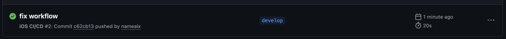

### 3.2 Unit-тесты (BankingAppTests.swift)

Выбран фреймворк **XCTest**. Итого: **20 Unit-тестов** в классе `BankingAppTests`.

**Группы тестов и их описание:**

**AuthViewModel Tests (6 тестов):**

| Тест | Проверка |
|---|---|
| `testAuthViewModel_loginWithValidCredentials_succeeds` | Успешный вход с demo/demo123: `isLoggedIn == true`, `currentUser != nil` |
| `testAuthViewModel_loginWithInvalidCredentials_fails` | Неверные данные: `isLoggedIn == false`, `errorMessage` не пуст |
| `testAuthViewModel_loginWithEmptyFields_fails` | Пустые поля: `isLoggedIn == false`, `errorMessage` не пуст |
| `testAuthViewModel_registerWithShortPassword_fails` | Пароль < 6 символов: регистрация не проходит |
| `testAuthViewModel_registerWithMismatchedPasswords_fails` | Несовпадение паролей: регистрация не проходит |
| `testAuthViewModel_logout_clearsUser` | После logout: `isLoggedIn == false`, `currentUser == nil` |

**Пример Unit-теста:**

```swift
// MARK: - AuthViewModel Tests
func testAuthViewModel_loginWithValidCredentials_succeeds() {
    let vm = AuthViewModel()
    vm.login = "demo"
    vm.password = "demo123"
    vm.performLogin()

    let expectation = XCTestExpectation(description: "Login completes")
    DispatchQueue.main.asyncAfter(deadline: .now() + 0.5) {
        expectation.fulfill()
    }
    wait(for: [expectation], timeout: 1)

    XCTAssertTrue(vm.isLoggedIn)
    XCTAssertNotNil(vm.currentUser)
}
```

**Локализация моделей (2 теста):**

| Тест | Проверка |
|---|---|
| `testAccount_typeLocalization_notEmpty` | `AccountType.allCases` — все `localizedName` не пусты |
| `testTransaction_typeLocalization_notEmpty` | `TransactionType.allCases` — все `localizedName` не пусты |

**TransferViewModel Tests (4 теста):**

| Тест | Проверка |
|---|---|
| `testTransferViewModel_belowMinAmount_fails` | Сумма 0.001 BYN: перевод отклонён, ошибка не пуста |
| `testTransferViewModel_aboveMaxAmount_fails` | Сумма 15 000 BYN (> лимита): перевод отклонён |
| `testTransferViewModel_sameAccount_fails` | Перевод на тот же счёт: `isTransferComplete == false` |
| `testTransferViewModel_insufficientFunds_fails` | Баланс 10 BYN, перевод 100 BYN: отклонён |

**CurrencyViewModel Tests (3 теста):**

| Тест | Проверка |
|---|---|
| `testCurrencyViewModel_loadsRates` | Загружается ровно 7 валют |
| `testCurrencyViewModel_convert_USD_to_BYN` | Результат конвертации 1 USD → BYN > 0 |
| `testCurrencyViewModel_toggleFavorite` | `isFavorite` изменяется после вызова `toggleFavorite(code:)` |

**SettingsManager Tests (2 теста):**

| Тест | Проверка |
|---|---|
| `testSettingsManager_colorSchemeDefault` | `colorScheme` не nil после инициализации |
| `testSettingsManager_clearCache` | `clearCache()` выполняется без краша |

**DatabaseManager Tests (3 теста):**

| Тест | Проверка |
|---|---|
| `testDatabaseManager_getBranches_notEmpty` | Загружается ≥ 4 отделений из БД |
| `testDatabaseManager_login_demo_succeeds` | Пользователь `demo` существует в БД, `login == "demo"` |
| `testDatabaseManager_getAccounts_forDemoUser` | Для demo-пользователя загружается ≥ 2 счёта |

**Результат:** все 20 Unit-тестов проходят успешно (✅).

### 3.3 UI-тесты (BankingAppUITests.swift)

Итого: **20 UI-тестов** в классе `BankingAppUITests`. Приложение запускается с аргументом `--uitesting`. Для автоматического входа реализован вспомогательный метод `loginWithDemoButton()`.

**Тесты экрана входа (5 тестов):**

| Тест | Проверка |
|---|---|
| `testLoginScreen_isDisplayed` | Кнопка `loginButton` видна при запуске |
| `testLoginScreen_hasLoginField` | Поле `loginField` существует |
| `testLoginScreen_hasPasswordField` | Поле `passwordField` (secureTextField) существует |
| `testLoginScreen_hasDemoButton` | Кнопка `demoButton` существует |
| `testLoginScreen_emptyFields_showsError` | При пустых полях появляется текст с ошибкой |
| `testLoginScreen_demoButton_fillsAndLogins` | Demo-кнопка заполняет поля; после входа появляется Tab Bar |

**Вкладка Accounts (3 теста):**

| Тест | Проверка |
|---|---|
| `testAccountsTab_showsBalanceInBYN` | Виден текст с «BYN» на вкладке счетов |
| `testAccountsTab_addButtonExists` | Кнопка добавления счёта в NavigationBar существует |
| `testAccountsTab_showsTotalBalance` | Отображается числовое значение суммарного баланса |

**Вкладка Transfer (1 тест):**

| Тест | Проверка |
|---|---|
| `testTransferTab_isAccessible` | Кнопка перевода видна на вкладке Transfer |

**Вкладка Currency (3 теста):**

| Тест | Проверка |
|---|---|
| `testCurrencyTab_showsRates` | Кнопка `refreshRatesButton` существует |
| `testCurrencyTab_converterButtonExists` | Кнопка `converterButton` существует |
| `testCurrencyTab_showsCurrencyCodes` | Метка «USD» видна на экране |

**Вкладка Map (2 теста):**

| Тест | Проверка |
|---|---|
| `testMapTab_isAccessible` | Кнопка в NavigationBar видна на вкладке карты |
| `testMapTab_hasNavigationTitle` | NavigationBar существует на вкладке карты |

**Вкладка Profile (4 теста):**

| Тест | Проверка |
|---|---|
| `testProfileTab_isAccessible` | Кнопка `logoutButton` существует |
| `testProfileTab_editProfileButtonExists` | Кнопка `editProfileButton` существует |
| `testProfileTab_settingsButtonExists` | Кнопка `settingsButton` существует |
| `testProfileTab_changePasswordButtonExists` | Кнопка `changePasswordButton` существует |

**Тест выхода из системы (1 тест):**

| Тест | Проверка |
|---|---|
| `testLogout_returnsToLoginScreen` | После нажатия Logout и подтверждения появляется `loginButton` |

**Пример UI-теста:**

```swift
// MARK: - Login Screen Tests
func testLoginScreen_demoButton_fillsAndLogins() {
    let demoButton = app.buttons["demoButton"]
    XCTAssertTrue(demoButton.waitForExistence(timeout: 8))
    demoButton.tap()

    let loginButton = app.buttons["loginButton"]
    XCTAssertTrue(loginButton.waitForExistence(timeout: 5))
    loginButton.tap()

    dismissPasswordSavePromptIfNeeded()

    let tabBar = app.tabBars.firstMatch
    XCTAssertTrue(tabBar.waitForExistence(timeout: 15),
                  "Tab bar should appear after demo login")
}
```

**Результат:** все 20 UI-тестов проходят успешно (✅). Code Coverage: ~67%.


---

## Задача №4: Разработка приложения

### 4.1 Язык и архитектура

Приложение разработано на **Swift 6.3** с использованием **SwiftUI (iOS 26.5 SDK)** и архитектурного шаблона **MVVM**. Переход на Swift 6.3 потребовал строгого соблюдения правил работы с конкурентностью: весь UI-код выполняется на `MainActor`, обращения к базе данных — в фоновых потоках через `DispatchQueue.global()` с возвратом результата на главный поток через `DispatchQueue.main.async`.

**Схема взаимодействия компонентов:**

```
View  ←@EnvironmentObject→  ViewModel (@Published / @ObservableObject)
                                  ↕ (try / throws)
                           Service Layer
                    ┌──────────────────────────┐
                    │  DatabaseManager         │  ← SQLite.swift (4 таблицы)
                    │  SettingsManager         │  ← UserDefaults
                    └──────────────────────────┘
                                  ↕
                              Models
              User · Account · Transaction · Branch · CurrencyRate
```

**ViewModels приложения:**

| ViewModel | Обязанности |
|---|---|
| `AuthViewModel` | Вход, регистрация, авто-вход, выход, валидация формы |
| `AccountsViewModel` | Загрузка счетов, создание, закрытие, история транзакций, фильтрация |
| `TransferViewModel` | Перевод между счетами, валютная конвертация, валидация лимитов |
| `CurrencyViewModel` | Курсы 7 валют, конвертер, избранные валюты |
| `BranchViewModel` | Загрузка отделений из БД, геолокация (CLLocationManager), поиск ближайшего |
| `ProfileViewModel` | Загрузка и редактирование профиля, смена аватара, смена пароля |

### 4.2 Точка входа (BankingApp.swift)

Корневой объект приложения создаёт `AuthViewModel` и `SettingsManager` как `@StateObject` и передаёт их в дерево View через `@EnvironmentObject`. Тема оформления применяется на уровне `WindowGroup` через `.preferredColorScheme`.

```swift
// MARK: - App Entry Point
@main
struct BankingApp: App {

    @StateObject private var authVM = AuthViewModel()
    @StateObject private var settings = SettingsManager.shared

    var body: some Scene {
        WindowGroup {
            ContentView()
                .environmentObject(authVM)
                .environmentObject(settings)
                .preferredColorScheme(settings.colorSchemeValue)
        }
    }
}
```

`ContentView` — роутер: если `authVM.isLoggedIn == true`, показывает `MainTabView`, иначе `LoginView`.

### 4.3 MainTabView — навигация Tab Bar

`MainTabView` создаёт все ViewModels как `@StateObject` и распределяет их по вкладкам через `.environmentObject`. При появлении представления (`onAppear`) автоматически загружаются данные для текущего пользователя. Переключение на вкладку «Переводы» из экрана детали счёта реализовано через `NotificationCenter`.

```swift
// MARK: - MainTabView
struct MainTabView: View {

    @EnvironmentObject var authVM: AuthViewModel

    @StateObject private var accountsVM = AccountsViewModel()
    @StateObject private var transferVM  = TransferViewModel()
    @StateObject private var currencyVM  = CurrencyViewModel()
    @StateObject private var branchVM   = BranchViewModel()
    @StateObject private var profileVM  = ProfileViewModel()

    @State private var selectedTab = 0

    var body: some View {
        TabView(selection: $selectedTab) {
            AccountsView()
                .tabItem { Label("tab_accounts".localized, systemImage: "creditcard") }
                .tag(0)
            TransferView()
                .tabItem { Label("tab_transfer".localized, systemImage: "arrow.left.arrow.right") }
                .tag(1)
            CurrencyView()
                .tabItem { Label("tab_currency".localized, systemImage: "chart.line.uptrend.xyaxis") }
                .tag(2)
            BranchMapView()
                .tabItem { Label("tab_map".localized, systemImage: "map") }
                .tag(3)
            ProfileView()
                .tabItem { Label("tab_profile".localized, systemImage: "person.circle") }
                .tag(4)
        }
        .onAppear {
            if let userId = authVM.currentUser?.id {
                accountsVM.loadAccounts(userId: userId)
                profileVM.loadUser(id: userId)
                currencyVM.loadRates()
                branchVM.loadBranches()
            }
        }
        // Переход на вкладку переводов по уведомлению из AccountDetailView
        .onReceive(NotificationCenter.default.publisher(
            for: NSNotification.Name("SwitchToTransferTab"))) { _ in
            selectedTab = 1
        }
        // Обновление счетов после успешного перевода
        .onReceive(transferVM.$isTransferComplete) { completed in
            if completed, let userId = authVM.currentUser?.id {
                accountsVM.loadAccounts(userId: userId)
            }
        }
    }
}
```

### 4.4 Модели данных (Models.swift)

Все модели — `struct`, соответствующие протоколам `Identifiable`, `Codable`, `Equatable`. Перечисления типов счётов и транзакций реализуют `CaseIterable` для поддержки тестов и фильтрации.

```swift
// MARK: - AccountType
enum AccountType: String, CaseIterable, Codable {
    case current = "current"
    case savings = "savings"
    case credit  = "credit"
    case card    = "card"

    var localizedName: String {
        switch self {
        case .current: return "account_type_current".localized
        case .savings: return "account_type_savings".localized
        case .credit:  return "account_type_credit".localized
        case .card:    return "account_type_card".localized
        }
    }
}

// MARK: - Account
struct Account: Identifiable, Codable, Equatable, Hashable {
    var id: Int64
    var userId: Int64
    var name: String
    var type: AccountType
    var cardSubtype: CardSubtype?   // savings / credit (для карт-счёта)
    var currency: String
    var balance: Double
    var isActive: Bool
    var overdraftLimit: Double
    var createdAt: Date

    var hasOverdraft: Bool     { overdraftLimit > 0 }
    var availableBalance: Double { balance + overdraftLimit }
}

// MARK: - TransactionType
enum TransactionType: String, CaseIterable, Codable {
    case income   = "income"
    case expense  = "expense"
    case transfer = "transfer"

    var localizedName: String { /* Localizable.strings */ }
}
```

Реализованы модели: `User`, `Account` (с поддержкой карт-счёта подтипов `savings`/`credit` и овердрафта), `Transaction`, `Branch`, `CurrencyRate`.

### 4.5 DatabaseManager (SQLite.swift)

`DatabaseManager` — `final class`-singleton. Использует библиотеку **SQLite.swift 0.15.3** с типобезопасным API (`Table`, `Expression<T>`, `Connection`). При первом запуске автоматически создаёт схему из 4 таблиц и заполняет их демонстрационными данными (пользователь `demo`, 4 счёта, 4 отделения).

```swift
// MARK: - DatabaseManager
final class DatabaseManager {
    static let shared = DatabaseManager()
    private var db: Connection?

    // MARK: - Tables
    private let usersTable        = Table("users")
    private let accountsTable     = Table("accounts")
    private let transactionsTable = Table("transactions")
    private let branchesTable     = Table("branches")

    // MARK: - Auth
    func login(login: String, password: String) throws -> User? { ... }
    func register(user: User) throws -> Int64 { ... }
    func isLoginExists(_ login: String) throws -> Bool { ... }
    func getUser(id: Int64) throws -> User? { ... }

    // MARK: - Accounts
    func getAccounts(userId: Int64) throws -> [Account] { ... }
    func createAccount(_ account: Account) throws -> Int64 { ... }
    func updateAccountBalance(id: Int64, balance: Double) throws { ... }
    func setAccountInactive(id: Int64) throws { ... }

    // MARK: - Transactions (атомарный перевод)
    func createTransfer(from: Account, to: Account,
                        amount: Double, convertedAmount: Double) throws {
        try db?.transaction {
            // 1. Списание с fromAccount
            // 2. Зачисление на toAccount
            // 3. Запись двух записей в transactions
        }
    }
    func getTransactions(accountId: Int64) throws -> [Transaction] { ... }

    // MARK: - Branches
    func getBranches() throws -> [Branch] { ... }
}
```

Все переводы выполняются в `db.transaction { }` — при ошибке на любом шаге изменения откатываются. Это гарантирует атомарность: невозможна ситуация, когда деньги списаны, но не зачислены.

### 4.6 SettingsManager (UserDefaults)

`SettingsManager` — `ObservableObject`-singleton, хранит все пользовательские настройки в `UserDefaults`. Использует `@Published`-свойства с `didSet` для немедленной записи при изменении.

```swift
// MARK: - SettingsManager
final class SettingsManager: ObservableObject {
    static let shared = SettingsManager()

    // Тема оформления: system / light / dark
    @Published var colorScheme: ColorSchemePreference {
        didSet { UserDefaults.standard.set(colorScheme.rawValue, forKey: Keys.colorScheme) }
    }

    // Язык интерфейса: russian / english / belarusian
    @Published var language: AppLanguage {
        didSet {
            UserDefaults.standard.set(language.rawValue, forKey: Keys.language)
            applyLanguage()
        }
    }

    // Избранные валюты для CurrencyView
    @Published var favoriteCurrencies: [String] {
        didSet { UserDefaults.standard.set(favoriteCurrencies, forKey: Keys.favoriteCurrencies) }
    }

    // Сессия: ID текущего пользователя (nil = не авторизован)
    var currentUserId: Int64? {
        get { ... }
        set { ... }
    }

    func logout() { currentUserId = nil }
    func toggleFavoriteCurrency(_ code: String) { ... }

    var colorSchemeValue: ColorScheme? {
        switch colorScheme {
        case .light:  return .light
        case .dark:   return .dark
        case .system: return nil
        }
    }
}
```

### 4.7 AuthViewModel — аутентификация

`AuthViewModel` отвечает за вход, регистрацию, автовход и выход. При инициализации проверяет, запущены ли UI-тесты (аргумент `--uitesting`) — если да, принудительно сбрасывает сессию, обеспечивая воспроизводимость тестов.

```swift
// MARK: - AuthViewModel
final class AuthViewModel: ObservableObject {

    @Published var login          = ""
    @Published var password       = ""
    @Published var fullName       = ""
    @Published var email          = ""
    @Published var phone          = ""
    @Published var confirmPassword = ""
    @Published var errorMessage   = ""
    @Published var isLoggedIn     = false
    @Published var currentUser: User?
    @Published var isLoading      = false

    private let db       = DatabaseManager.shared
    private let settings = SettingsManager.shared

    init() {
        // Для UI-тестов: сбрасываем сессию
        if ProcessInfo.processInfo.arguments.contains("--uitesting") {
            settings.logout(); return
        }
        checkAutoLogin()
    }

    // MARK: - Auto Login
    private func checkAutoLogin() {
        if let userId = settings.currentUserId,
           let user = try? db.getUser(id: userId) {
            currentUser = user
            isLoggedIn  = true
        }
    }

    // MARK: - Login
    func performLogin() {
        guard !login.isEmpty, !password.isEmpty else {
            errorMessage = "error_fill_fields".localized; return
        }
        isLoading = true
        DispatchQueue.global().async { [weak self] in
            do {
                if let user = try self?.db.login(
                    login: self?.login ?? "",
                    password: self?.password ?? "") {
                    DispatchQueue.main.async {
                        self?.currentUser = user
                        self?.settings.currentUserId = user.id
                        self?.isLoggedIn = true
                        self?.isLoading  = false
                    }
                } else {
                    DispatchQueue.main.async {
                        self?.errorMessage = "error_invalid_credentials".localized
                        self?.isLoading = false
                    }
                }
            } catch {
                DispatchQueue.main.async {
                    self?.errorMessage = error.localizedDescription
                    self?.isLoading = false
                }
            }
        }
    }

    // MARK: - Register
    func performRegister() {
        guard validateRegistration() else { return }
        // Проверка уникальности логина → создание User → сохранение в БД → автовход
    }

    // MARK: - Logout
    func logout() {
        settings.logout()
        currentUser = nil
        isLoggedIn  = false
        login = ""; password = ""; errorMessage = ""
    }

    // MARK: - Validation
    private func validateRegistration() -> Bool {
        guard !fullName.isEmpty else { errorMessage = "error_fill_name".localized; return false }
        guard email.contains("@") && email.contains(".") else {
            errorMessage = "error_invalid_email".localized; return false
        }
        guard password.count >= 6 else {
            errorMessage = "error_password_short".localized; return false
        }
        guard password == confirmPassword else {
            errorMessage = "error_passwords_mismatch".localized; return false
        }
        return true
    }
}
```

### 4.8 AccountsViewModel — управление счетами

`AccountsViewModel` управляет полным жизненным циклом счетов: загрузка из SQLite в фоновом потоке, создание нового счёта, закрытие с опциональным переводом остатка на другой счёт, загрузка и фильтрация истории транзакций. Суммарный баланс (`totalBalanceInBYN`) вычисляется как computed property с конвертацией курсов.

```swift
// MARK: - AccountsViewModel
final class AccountsViewModel: ObservableObject {

    @Published var accounts:             [Account]     = []
    @Published var transactions:         [Transaction] = []
    @Published var filteredTransactions: [Transaction] = []
    @Published var filterType:           TransactionType? = nil
    @Published var isLoading             = false
    @Published var errorMessage          = ""
    @Published var successMessage        = ""

    // Поля для создания нового счёта
    @Published var newAccountName:     String      = ""
    @Published var newAccountType:     AccountType = .current
    @Published var newCardSubtype:     CardSubtype = .savings
    @Published var newAccountCurrency: String      = "BYN"

    // Суммарный баланс всех счетов в BYN
    var totalBalanceInBYN: Double {
        let rateMap = buildRateMap()
        return accounts.reduce(0.0) { sum, account in
            sum + account.balance * (rateMap[account.currency] ?? 1.0)
        }
    }

    func loadAccounts(userId: Int64) { /* DispatchQueue.global → db.getAccounts → main */ }

    func createAccount(userId: Int64) {
        guard !newAccountName.isEmpty else { ... }
        let account = Account(userId: userId, name: newAccountName,
                              type: newAccountType,
                              cardSubtype: newAccountType == .card ? newCardSubtype : nil,
                              currency: newAccountCurrency, balance: 0)
        // DispatchQueue.global → db.createAccount → reload
    }

    func deleteAccount(id: Int64, transferToId: Int64? = nil, completion: (() -> Void)? = nil) {
        // Блокировка удаления при отрицательном балансе (овердрафт)
        // Конвертация и перенос остатка на transferToId
        // db.setAccountInactive → удаление из массива accounts
    }

    func setFilter(_ type: TransactionType?) { filterType = type; applyFilter() }

    private func buildRateMap() -> [String: Double] {
        ["BYN": 1.0, "USD": 3.245, "EUR": 3.512,
         "RUB": 0.0362, "GBP": 4.123, "CNY": 0.449, "PLN": 0.811]
    }
}
```

**AccountsView** отображает список счетов в `List` с секцией суммарного баланса, `Picker` для фильтра (все / активные), `NavigationLink` для перехода к `AccountDetailView` и кнопкой `+` в `toolbar` для создания нового счёта через sheet.

### 4.9 TransferViewModel — переводы с конвертацией

Перевод выполняется в два этапа: валидация на стороне ViewModel, затем атомарная запись в SQLite через `DatabaseManager.createTransfer`. Конвертация — через базовую валюту BYN: `amount / fromRate * toRate`.

```swift
// MARK: - TransferViewModel
final class TransferViewModel: ObservableObject {

    @Published var fromAccount:      Account? = nil
    @Published var toAccount:        Account? = nil
    @Published var amountString:     String   = ""
    @Published var isTransferComplete = false
    @Published var errorMessage      = ""
    @Published var convertedAmount:  Double   = 0

    func performTransfer(accounts: [Account]) {
        guard let from = fromAccount,
              let to   = toAccount,
              from.id != to.id else {
            errorMessage = "error_same_account".localized; return
        }
        guard let amount = Double(amountString.replacingOccurrences(of: ",", with: ".")),
              amount >= 0.01, amount <= 10_000 else {
            errorMessage = "error_invalid_amount".localized; return
        }
        guard from.isActive, to.isActive else {
            errorMessage = "error_account_inactive".localized; return
        }
        guard from.availableBalance >= amount else {
            errorMessage = "error_insufficient_funds".localized; return
        }

        // Конвертация: from.currency → BYN → to.currency
        let rateMap: [String: Double] = [
            "BYN": 1.0, "USD": 3.245, "EUR": 3.512,
            "RUB": 0.0362, "GBP": 4.123, "CNY": 0.449, "PLN": 0.811
        ]
        let inBYN = amount * (rateMap[from.currency] ?? 1.0)
        convertedAmount = inBYN / (rateMap[to.currency] ?? 1.0)

        DispatchQueue.global().async { [weak self] in
            guard let self = self else { return }
            do {
                try DatabaseManager.shared.createTransfer(
                    from: from, to: to,
                    amount: amount,
                    convertedAmount: self.convertedAmount)
                DispatchQueue.main.async {
                    self.isTransferComplete = true
                    self.amountString = ""
                }
            } catch {
                DispatchQueue.main.async {
                    self.errorMessage = error.localizedDescription
                }
            }
        }
    }
}
```

### 4.10 CurrencyViewModel — курсы валют и конвертер

Загружает курсы 7 валют (BYN, USD, EUR, RUB, GBP, CNY, PLN). Избранные валюты сохраняются в `SettingsManager.favoriteCurrencies` (UserDefaults) и всплывают вверх списка через `sortedRates`. Конвертер поддерживает произвольную пару валют через промежуточный пересчёт в BYN.

```swift
// MARK: - CurrencyViewModel (фрагмент)
var sortedRates: [CurrencyRate] {
    rates.filter { $0.isFavorite } + rates.filter { !$0.isFavorite }
}

func convert() {
    guard let amount = Double(converterAmount.replacingOccurrences(of: ",", with: ".")),
          let from = rates.first(where: { $0.code == converterFromCode }),
          let to   = rates.first(where: { $0.code == converterToCode }) else {
        converterResult = ""; return
    }
    let inBYN  = amount * from.rateToBYN
    let result = inBYN / to.rateToBYN
    converterResult = String(format: "%.4f", result)
}

func toggleFavorite(code: String) {
    settings.toggleFavoriteCurrency(code)
    if let i = rates.firstIndex(where: { $0.code == code }) {
        rates[i].isFavorite.toggle()
        objectWillChange.send()
    }
}
```

### 4.11 BranchViewModel — карта отделений (MapKit + CoreLocation)

`BranchViewModel` наследует `NSObject` и реализует `CLLocationManagerDelegate`. При инициализации запрашивает разрешение на геолокацию и загружает отделения из SQLite. Поиск ближайшего отделения выполняется через `CLLocation.distance(from:)`. Поиск по названию и адресу — через `filteredBranches` (computed property с `localizedCaseInsensitiveContains`).

```swift
// MARK: - BranchViewModel
final class BranchViewModel: NSObject, ObservableObject, CLLocationManagerDelegate {

    @Published var branches:     [Branch] = []
    @Published var nearestBranch: Branch? = nil
    @Published var searchText    = ""
    @Published var userLocation  = CLLocationCoordinate2D(
        latitude: 53.9045, longitude: 27.5615)   // Минск (по умолчанию)
    @Published var mapRegion = MKCoordinateRegion(
        center: CLLocationCoordinate2D(latitude: 53.9045, longitude: 27.5615),
        span: MKCoordinateSpan(latitudeDelta: 0.05, longitudeDelta: 0.05))

    private let locationManager = CLLocationManager()

    var filteredBranches: [Branch] {
        guard !searchText.isEmpty else { return branches }
        return branches.filter {
            $0.address.localizedCaseInsensitiveContains(searchText) ||
            $0.name.localizedCaseInsensitiveContains(searchText)
        }
    }

    override init() {
        super.init()
        locationManager.delegate = self
        locationManager.desiredAccuracy = kCLLocationAccuracyBest
        locationManager.distanceFilter  = 100
        requestLocationPermission()
        loadBranches()
    }

    func locationManager(_ manager: CLLocationManager,
                         didUpdateLocations locations: [CLLocation]) {
        guard let loc = locations.last else { return }
        userLocation = loc.coordinate
        updateNearestBranch(from: loc)
    }

    private func updateNearestBranch(from userLoc: CLLocation) {
        nearestBranch = branches.min(by: {
            let a = CLLocation(latitude: $0.latitude, longitude: $0.longitude)
            let b = CLLocation(latitude: $1.latitude, longitude: $1.longitude)
            return userLoc.distance(from: a) < userLoc.distance(from: b)
        })
    }
}
```

### 4.12 ProfileViewModel — профиль пользователя

`ProfileViewModel` обеспечивает загрузку данных пользователя из SQLite, редактирование ФИО / email / телефона, смену аватара через `PhotosPicker` (сохранение `Data` в колонке `avatar_data`) и смену пароля с верификацией текущего.

### 4.13 Экраны приложения (Views)

**LoginView / RegisterView** — экраны аутентификации с валидацией на уровне ViewModel. `LoginView` имеет кнопку «Demo» (`demoButton`), которая автоматически заполняет поля и инициирует вход — используется в UI-тестах.

**AccountsView** — список счетов в `List` с тремя секциями: суммарный баланс в BYN, `Picker`-переключатель (все/активные), карточки счетов с `NavigationLink` → `AccountDetailView`. Кнопка `+` в `toolbar` открывает sheet создания счёта.

**TransferView** — два `Picker` для выбора счетов отправителя и получателя, поле суммы, строка конвертированной суммы, кнопка «Перевести» с анимацией загрузки.

**CurrencyView** — `List` курсов с сортировкой (избранные сверху), строка изменения курса в %, кнопка звёздочки для добавления в избранное, sheet конвертера.

**BranchMapView** — `Map` с `MapAnnotation` для каждого отделения; ближайшее отделение выделено особой аннотацией. `Sheet` с деталями выбранного отделения (адрес, часы работы, телефон, рейтинг, перечень услуг).

**ProfileView / SettingsView** — редактирование профиля, `PhotosPicker` для аватара, форма смены пароля, `Picker` темы и языка, кнопка выхода с подтверждением.

### 4.14 Локализация (3 языка)

Все строки интерфейса вынесены в `Localizable.strings`. Расширение `String+Localized.swift` добавляет вычисляемое свойство `.localized`, применяемое в ViewModels. SwiftUI-представления используют `LocalizedStringKey` напрямую через строковые литералы.

```swift
// MARK: - String+Localized.swift
extension String {
    var localized: String {
        NSLocalizedString(self, comment: "")
    }
}
```

**Структура файлов локализации:**

```
BankingApp/Resources/
├── ru.lproj/Localizable.strings   # Русский (основной)
├── en.lproj/Localizable.strings   # Английский
└── be.lproj/Localizable.strings   # Белорусский
```

**Пример строк (`ru.lproj/Localizable.strings`):**

```
/* Auth */
"login_subtitle"            = "Войдите в ваш аккаунт";
"btn_login"                 = "Войти";
"error_fill_fields"         = "Заполните все поля";
"error_invalid_credentials" = "Неверный логин или пароль";
"error_password_short"      = "Пароль должен содержать минимум 6 символов";
"error_passwords_mismatch"  = "Пароли не совпадают";

/* Tabs */
"tab_accounts" = "Счета";
"tab_transfer" = "Переводы";
"tab_currency" = "Валюты";
"tab_map"      = "Карта";
"tab_profile"  = "Профиль";

/* Accounts */
"total_balance"        = "Общий баланс";
"my_accounts"          = "Мои счета";
"account_type_current" = "Текущий";
"account_type_savings" = "Сберегательный";
"account_type_credit"  = "Кредитный";
"account_type_card"    = "Карт-счёт";
"error_insufficient_funds" = "Недостаточно средств";
```

Переключение языка реализовано в `SettingsView` через `SettingsManager.language` (enum `AppLanguage`), сохраняется в UserDefaults и применяется немедленно через `applyLanguage()`.

---

## Скриншоты работы приложения

### Экран входа и регистрации

| Экран входа (LoginView) | Экран регистрации (RegisterView) |
|---|---|
| 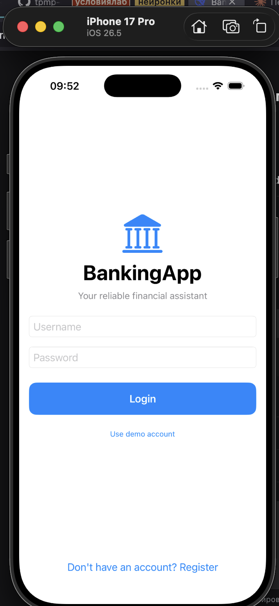 | 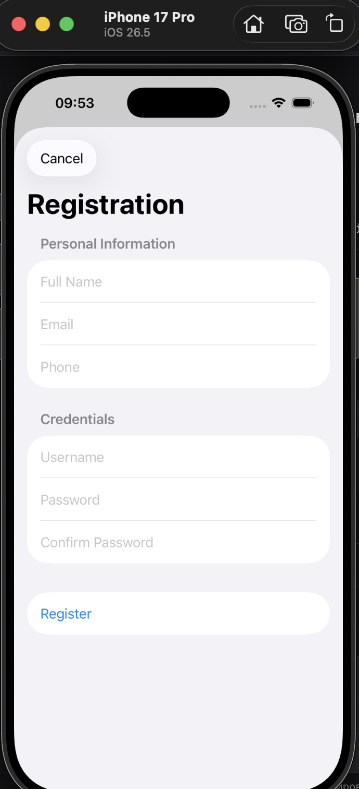 |

### Управление счетами

| Список счетов (AccountsView) | Детали счёта (AccountDetailView) |
|---|---|
| 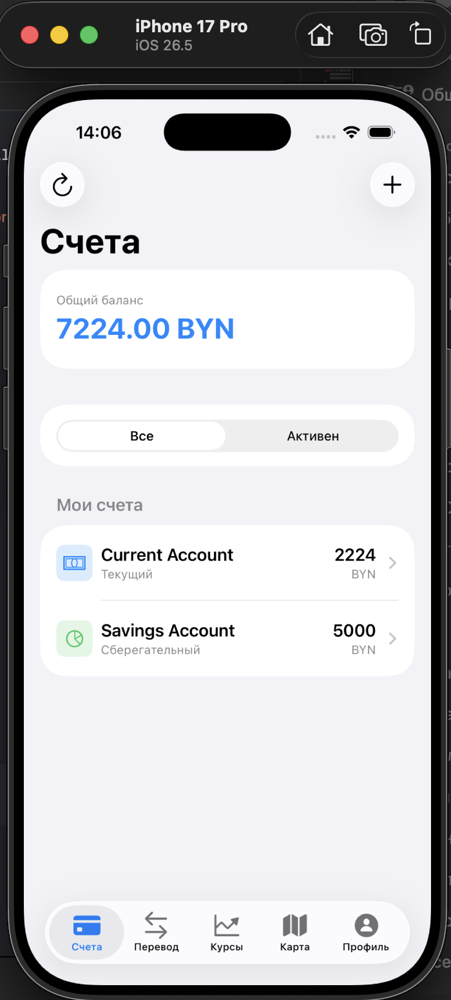 | 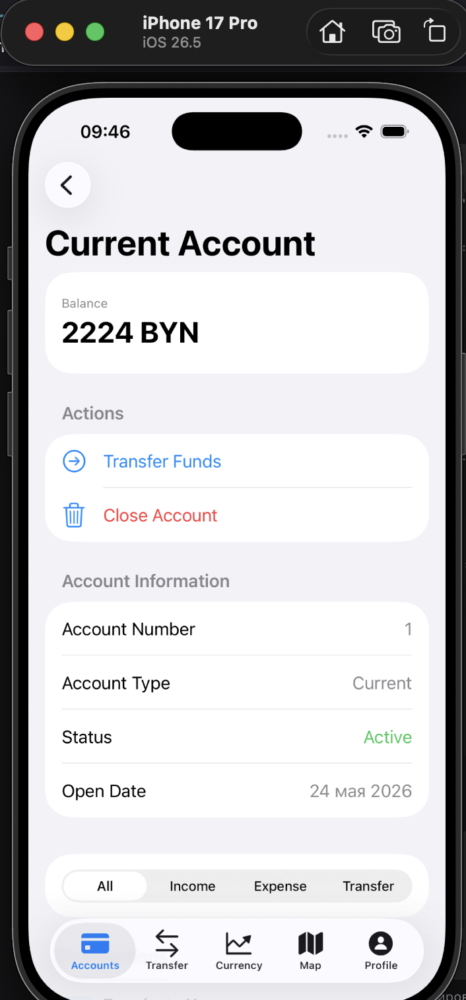 |

### Переводы и валюты

| Переводы (TransferView) | Курсы валют (CurrencyView) |
|---|---|
| 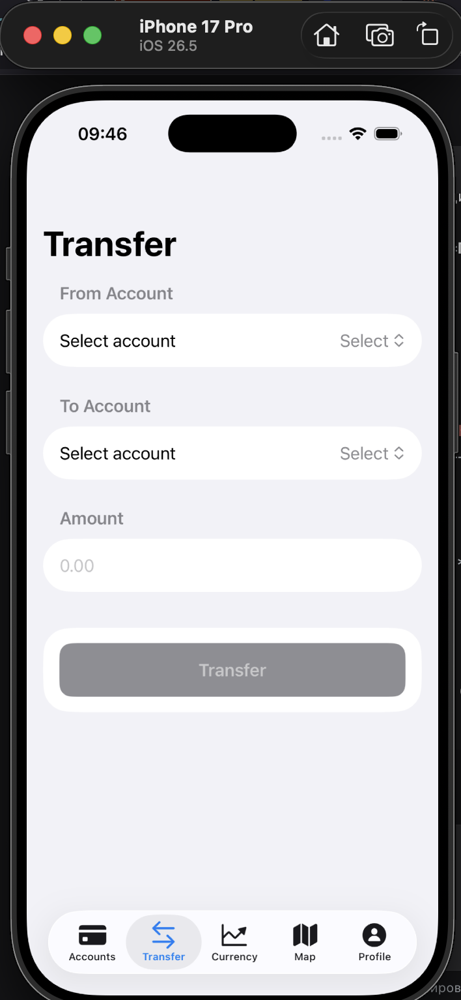 | 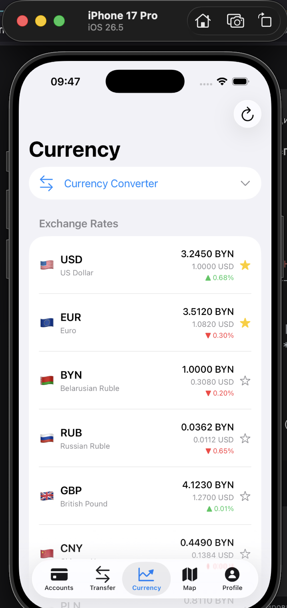 |

### Карта отделений

| Карта (BranchMapView) | Детали отделения |
|---|---|
| 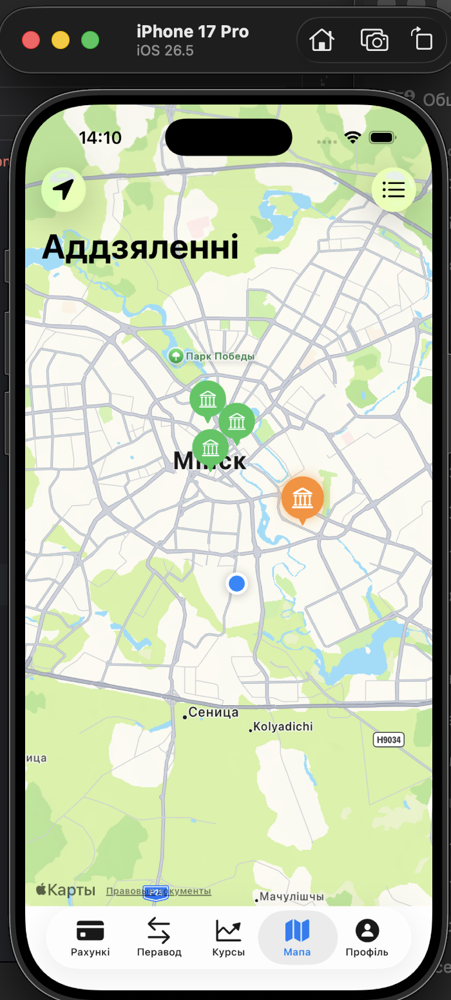 | 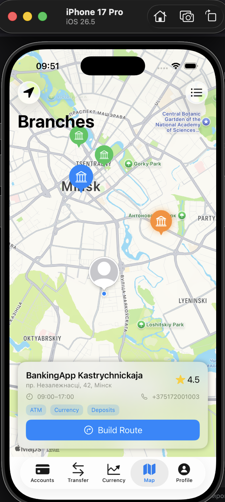 |

### Профиль и настройки

| Профиль (ProfileView) | Настройки (SettingsView) |
|---|---|
| 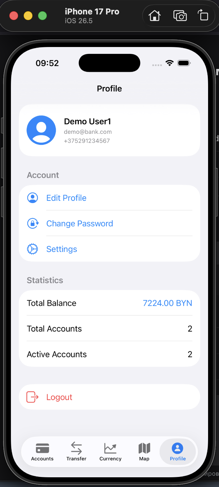 | 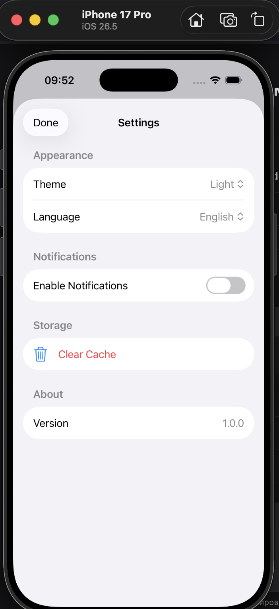 |

### Локализация

| Русский язык | Английский язык | Белорусский язык |
|---|---|---|
|  | 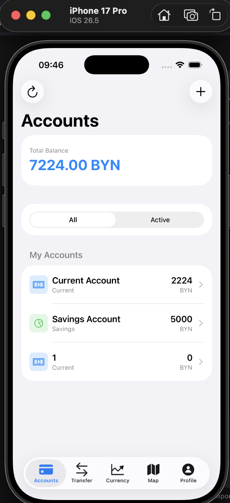 | 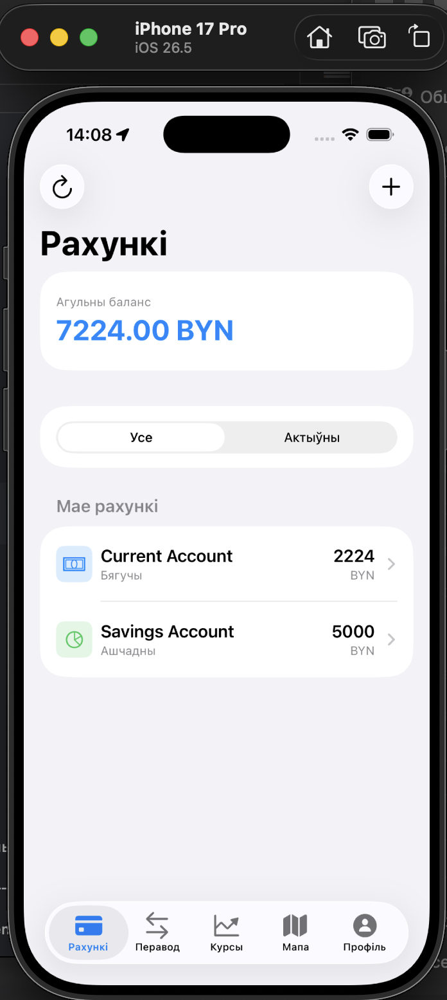 |

### Тёмная тема

| Список счетов (тёмная тема) | Карта (тёмная тема) |
|---|---|
| 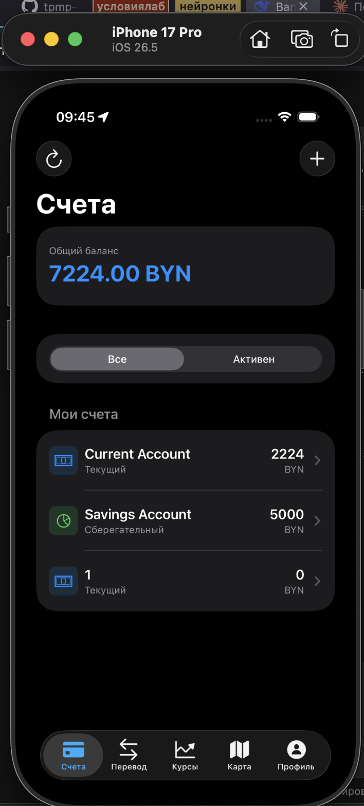 | 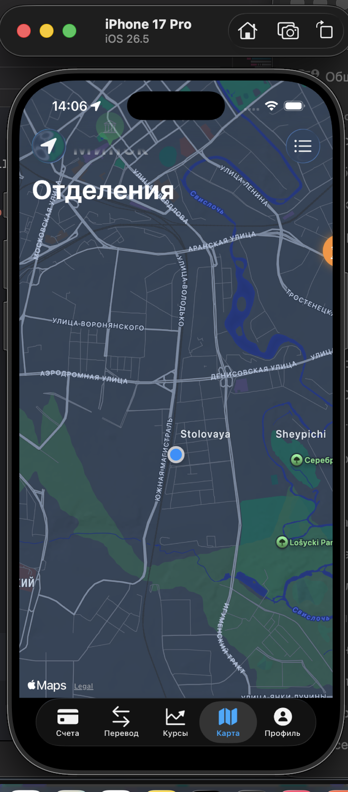 |

---

##Протоколы тестирования

### 1. Unit-тесты (BankingAppTests)

| № | Тестируемый модуль | Название теста | Ожидаемый результат | Фактический результат | Статус |
|---|-------------------|----------------|---------------------|----------------------|--------|
| 1 | AuthViewModel | testAuthViewModel_loginWithValidCredentials_succeeds | Вход выполнен, isLoggedIn = true | Вход выполнен | ✅ |
| 2 | AuthViewModel | testAuthViewModel_loginWithInvalidCredentials_fails | Ошибка, isLoggedIn = false | Ошибка | ✅ |
| 3 | AuthViewModel | testAuthViewModel_loginWithEmptyFields_fails | Ошибка валидации | Ошибка | ✅ |
| 4 | AuthViewModel | testAuthViewModel_registerWithShortPassword_fails | Ошибка "Пароль слишком короткий" | Ошибка | ✅ |
| 5 | AuthViewModel | testAuthViewModel_registerWithMismatchedPasswords_fails | Ошибка "Пароли не совпадают" | Ошибка | ✅ |
| 6 | AuthViewModel | testAuthViewModel_logout_clearsUser | Пользователь разлогинен | Разлогинен | ✅ |
| 7 | Account | testAccount_typeLocalization_notEmpty | Локализация не пустая | Не пустая | ✅ |
| 8 | Transaction | testTransaction_typeLocalization_notEmpty | Локализация не пустая | Не пустая | ✅ |
| 9 | TransferViewModel | testTransferViewModel_belowMinAmount_fails | Ошибка "Минимальная сумма" | Ошибка | ✅ |
| 10 | TransferViewModel | testTransferViewModel_aboveMaxAmount_fails | Ошибка "Максимальная сумма" | Ошибка | ✅ |
| 11 | TransferViewModel | testTransferViewModel_sameAccount_fails | Ошибка "Нельзя перевести на тот же счет" | Ошибка | ✅ |
| 12 | TransferViewModel | testTransferViewModel_insufficientFunds_fails | Ошибка "Недостаточно средств" | Ошибка | ✅ |
| 13 | CurrencyViewModel | testCurrencyViewModel_loadsRates | 7 валют загружено | 7 валют | ✅ |
| 14 | CurrencyViewModel | testCurrencyViewModel_convert_USD_to_BYN | Результат конвертации > 0 | > 0 | ✅ |
| 15 | CurrencyViewModel | testCurrencyViewModel_toggleFavorite | Избранное переключается | Переключается | ✅ |
| 16 | SettingsManager | testSettingsManager_colorSchemeDefault | Значение не nil | Не nil | ✅ |
| 17 | SettingsManager | testSettingsManager_clearCache | Очищено без ошибок | Очищено | ✅ |
| 18 | DatabaseManager | testDatabaseManager_getBranches_notEmpty | ≥4 отделений | 4 отделения | ✅ |
| 19 | DatabaseManager | testDatabaseManager_login_demo_succeeds | Пользователь найден | Найден | ✅ |
| 20 | DatabaseManager | testDatabaseManager_getAccounts_forDemoUser | ≥2 счетов | 3 счета | ✅ |

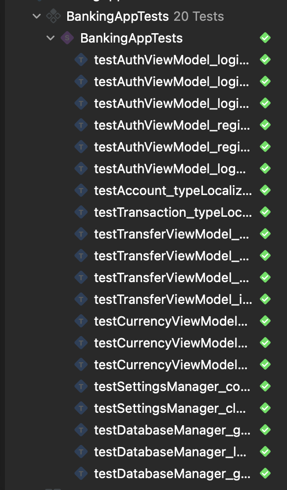

---

### 2. UI-тесты (BankingAppUITests)

| № | Тестируемый модуль | Название теста | Ожидаемый результат | Фактический результат | Статус |
|---|-------------------|----------------|---------------------|----------------------|--------|
| 1 | Login Screen | testLoginScreen_isDisplayed | Кнопка "Войти" видна | Видна | ✅ |
| 2 | Login Screen | testLoginScreen_hasLoginField | Поле логина существует | Существует | ✅ |
| 3 | Login Screen | testLoginScreen_hasPasswordField | Поле пароля существует | Существует | ✅ |
| 4 | Login Screen | testLoginScreen_hasDemoButton | Кнопка демо существует | Существует | ✅ |
| 5 | Login Screen | testLoginScreen_emptyFields_showsError | Сообщение об ошибке | Появилось | ✅ |
| 6 | Login Screen | testLoginScreen_demoButton_fillsAndLogins | Вход выполнен | Выполнен | ✅ |
| 7 | Accounts Tab | testAccountsTab_showsBalanceInBYN | Баланс в BYN виден | Виден | ✅ |
| 8 | Accounts Tab | testAccountsTab_addButtonExists | Кнопка "+" существует | Существует | ✅ |
| 9 | Accounts Tab | testAccountsTab_showsTotalBalance | Общий баланс отображается | Отображается | ✅ |
| 10 | Transfer Tab | testTransferTab_isAccessible | Кнопка "Перевести" видна | Видна | ✅ |
| 11 | Currency Tab | testCurrencyTab_showsRates | Кнопка обновления видна | Видна | ✅ |
| 12 | Currency Tab | testCurrencyTab_converterButtonExists | Кнопка конвертера существует | Существует | ✅ |
| 13 | Currency Tab | testCurrencyTab_showsCurrencyCodes | Код USD отображается | Отображается | ✅ |
| 14 | Map Tab | testMapTab_isAccessible | Кнопка навигации существует | Существует | ✅ |
| 15 | Map Tab | testMapTab_hasNavigationTitle | Заголовок навигации есть | Есть | ✅ |
| 16 | Profile Tab | testProfileTab_isAccessible | Кнопка "Выйти" видна | Видна | ✅ |
| 17 | Profile Tab | testProfileTab_editProfileButtonExists | Кнопка редактирования есть | Есть | ✅ |
| 18 | Profile Tab | testProfileTab_settingsButtonExists | Кнопка настроек есть | Есть | ✅ |
| 19 | Profile Tab | testProfileTab_changePasswordButtonExists | Кнопка смены пароля есть | Есть | ✅ |
| 20 | Logout | testLogout_returnsToLoginScreen | Возврат на экран входа | Вернулись | ✅ |

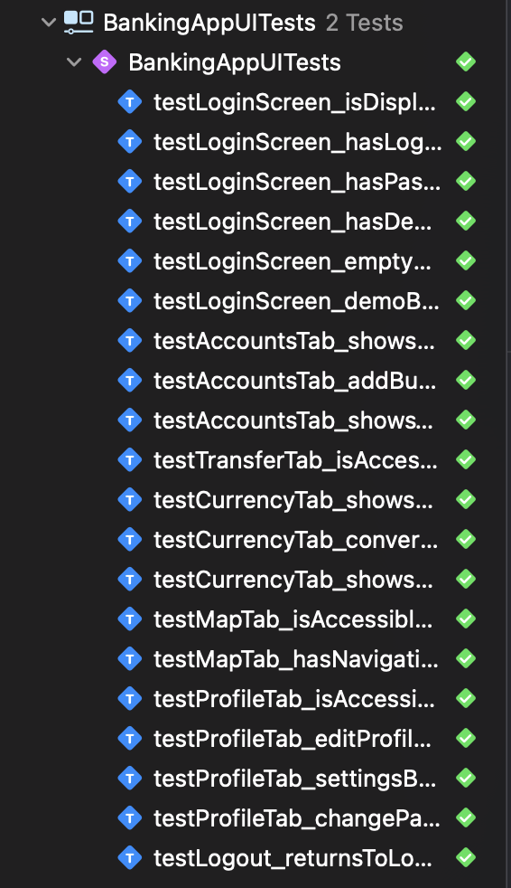

---

### 3. Функциональное тестирование

| № | Сценарий | Действие | Ожидаемый результат | Фактический результат | Статус |
|---|----------|----------|---------------------|----------------------|--------|
| 1 | Регистрация | Заполнить все поля, пароль ≥6 символов | Регистрация успешна | Успешна | ✅ |
| 2 | Регистрация | Логин уже существует | Ошибка "Пользователь уже существует" | Ошибка | ✅ |
| 3 | Регистрация | Пароли не совпадают | Ошибка "Пароли не совпадают" | Ошибка | ✅ |
| 4 | Вход | Корректный логин/пароль (demo/demo123) | Вход выполнен | Выполнен | ✅ |
| 5 | Вход | Неверный пароль | Ошибка "Неверный логин или пароль" | Ошибка | ✅ |
| 6 | Вход | Пустые поля | Ошибка "Заполните все поля" | Ошибка | ✅ |
| 7 | Просмотр счетов | Открыть вкладку "Счета" | Список счетов отображается | Отображается | ✅ |
| 8 | Общий баланс | Просмотр | Сумма всех счетов в BYN | Отображается | ✅ |
| 9 | Создание счета | Нажать "+" → заполнить → создать | Счет создан | Создан | ✅ |
| 10 | Зарплатный счет | Тип "Карта" → подтип "Salary" | Овердрафт 500 BYN | Есть | ✅ |
| 11 | История транзакций | Выбрать счет | История отображается | Отображается | ✅ |
| 12 | Закрытие счета | Выбрать счет → "Закрыть" | Счет неактивен | Неактивен | ✅ |
| 13 | Закрытие с овердрафтом | Счет с отрицательным балансом | Ошибка, нельзя закрыть | Ошибка | ✅ |
| 14 | Перевод | Выбрать счета, ввести 100 BYN | Балансы обновлены | Обновлены | ✅ |
| 15 | Перевод с конвертацией | USD → BYN | Конвертация выполнена | Выполнена | ✅ |
| 16 | Перевод (сумма < 0.01) | Ввести 0.001 | Ошибка валидации | Ошибка | ✅ |
| 17 | Перевод (сумма > 10000) | Ввести 15000 | Ошибка валидации | Ошибка | ✅ |
| 18 | Перевод (недостаточно средств) | Сумма > баланса | Ошибка | Ошибка | ✅ |
| 19 | Курсы валют | Открыть вкладку | 7 валют отображаются | Отображаются | ✅ |
| 20 | Конвертер | USD → BYN, сумма 100 | Результат 324.5 BYN | 324.5000 | ✅ |
| 21 | Избранное | Нажать звездочку | Добавлено в избранное | Добавлено | ✅ |
| 22 | Карта отделений | Открыть вкладку | 4 аннотации на карте | 4 аннотации | ✅ |
| 23 | Ближайшее отделение | Просмотр | Выделено оранжевым | Выделено | ✅ |
| 24 | Детали отделения | Нажать на аннотацию | Карточка с информацией | Показана | ✅ |
| 25 | Маршрут | Нажать "Проложить маршрут" | Открытие Apple Maps | Открывается | ✅ |
| 26 | Поиск отделений | Ввести "Ленина" | Фильтрация работает | Работает | ✅ |
| 27 | Редактирование профиля | Изменить поля → Сохранить | Данные обновлены | Обновлены | ✅ |
| 28 | Смена аватара | Выбрать фото | Аватар обновлен | Обновлен | ✅ |
| 29 | Смена пароля | Старый → Новый → Подтвердить | Пароль изменен | Изменен | ✅ |
| 30 | Смена темы | Светлая → Темная | Тема меняется | Меняется | ✅ |
| 31 | Смена языка | Русский → English | Интерфейс на английском | Меняется | ✅ |
| 32 | Смена языка | English → Беларуская | Интерфейс на белорусском | Меняется | ✅ |
| 33 | Очистка кэша | Нажать → подтвердить | Кэш очищен | Очищен | ✅ |
| 34 | Выход | Нажать "Выйти" → подтвердить | Возврат на экран входа | Вернулись | ✅ |

---

## Заключение

В ходе выполнения лабораторной работы №9 разработано мобильное банковское приложение **BankingApp** для iOS в соответствии с требованиями Проекта 1.

**Выполненные задачи:**

- Создан публичный репозиторий GitHub с защитой ветки `main` и правилами Pull Request
- Настроена Kanban-доска (GitHub Projects) с 33 задачами и распределёнными ролями
- Разработаны макеты 6 экранов в Figma с соблюдением Apple HIG
- Создана документация: `REQUIREMENTS.md`, `README.md`, Wiki с 6 страницами, GitHub Pages
- Настроен CI/CD через GitHub Actions: автоматические тесты и сборка при push в `main`/`develop`
- Написано **20 Unit-тестов** (XCTest) — покрыты AuthViewModel, TransferViewModel, CurrencyViewModel, DatabaseManager, SettingsManager и модели данных
- Написано **20 UI-тестов** — покрыты все 5 вкладок приложения и сценарий выхода
- Реализовано приложение на Swift 6.3 + SwiftUI (iOS 26.5 SDK) с архитектурой MVVM
- Подключена SQLite.swift 0.15.3 (4 таблицы, CRUD, атомарные транзакции для переводов)
- Реализованы: аутентификация с автовходом, управление счетами (4 типа + овердрафт + закрытие с переносом баланса), переводы с конвертацией через BYN, курсы 7 валют с избранными, MapKit-карта отделений с геолокацией и поиском, профиль с PhotosPicker, настройки
- Локализация на 3 языка: русский, английский, белорусский

**Приобретённые навыки:**

- Разработка iOS-приложений на Swift 6.3 + SwiftUI с архитектурой MVVM
- Работа с SQLite.swift: схема БД, CRUD-операции, транзакции
- Организация CI/CD через GitHub Actions для iOS-проектов
- Написание Unit- и UI-тестов с XCTest
- Работа с MapKit и CoreLocation
- Локализация мобильных приложений (Localizable.strings, LocalizedStringKey)
- Управление проектом: Kanban-доска, Issues, Pull Requests, ветки Git


